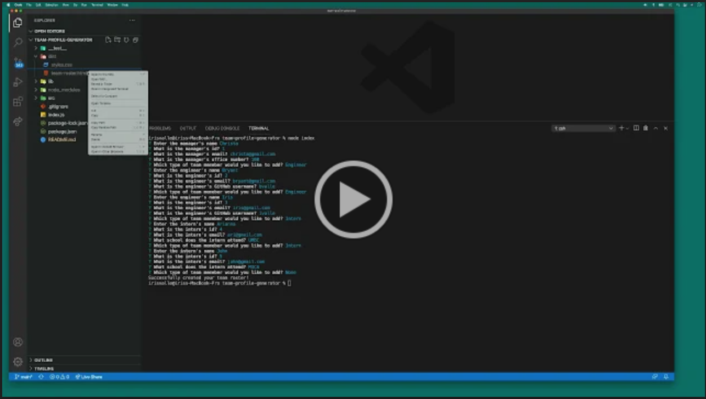

# team-profile-generator

  ## Description

  A command-line application that dynamically generates a team roster html from a user’s input using the Inquirer package.

  ## Installation

  To install necessary dependencies, run the following command:

  ```md
  npm i
  ```

  ## Usage

  Open the integrated terminal. Run node index.js. Add memebers to your team by responding to the prompts. Below is a walkthrough video that demonstrates how a user would invoke the application from the command line and enter responses to all of the prompts.

  <a href="https://drive.google.com/file/d/1SVEfqLgSQz8AnG32O78ENSQVnCEOTPNs/view"></a><br>

  ## Tests

  To run tests, run the following command:

  ```md
  npm run test
  ```


  
  
